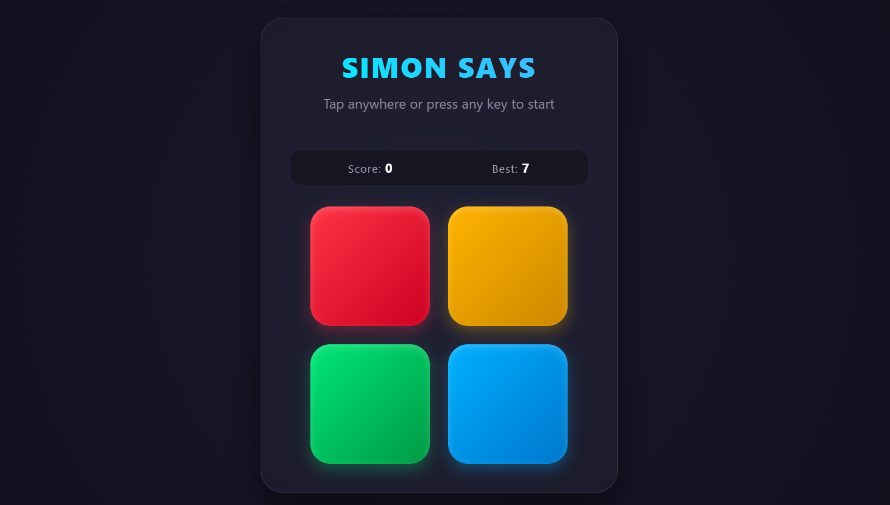

# Simon Says - Arcade Edition 🎮

A modern, responsive, arcade-style **Simon Says** memory game built with vanilla HTML, CSS, and JavaScript. It features dynamic sound effects using the Web Audio API, animated button flashes, smooth UI transitions, and local storage support to save your high score.

---

## 📸 Preview



---

## ✨ Features

- **Arcade UI Theme:** Modern dark theme with smooth gradients, glassmorphism, and dynamic animations.
- **Web Audio API:** Custom sound tones generated on-the-fly without external audio files.
- **Dynamic Difficulty:** Flash duration speeds up progressively as levels increase.
- **High Score Tracking:** Keeps track of your best score using `localStorage`.
- **Responsive Design:** Plays smoothly on both mobile devices and desktop screens.

---

## 🛠️ Project Structure

```
├── index.html   # Main HTML layout
├── style.css    # Styling, layout, animations, and gradients
├── app.js       # Game logic and sound synthesizers
└── screenshot.png # Screenshot of the game for documentation
```

---

## 🚀 How to Run

1. **Clone or Download** this repository.
2. Ensure `index.html`, `style.css`, `app.js`, and `screenshot.png` are in the same folder.
3. Open `index.html` in any web browser.

---

## 🕹️ How to Play

1. Tap anywhere on the screen or press any key to **start**.
2. Watch the sequence of lighted buttons carefully and listen to their tones.
3. Repeat the exact sequence by clicking or tapping the colored buttons.
4. Each round adds a new random step to the sequence.
5. Missing a sequence results in **Game Over**!

---

## 📜 License

This project is open-source and free to use for learning and personal projects.
